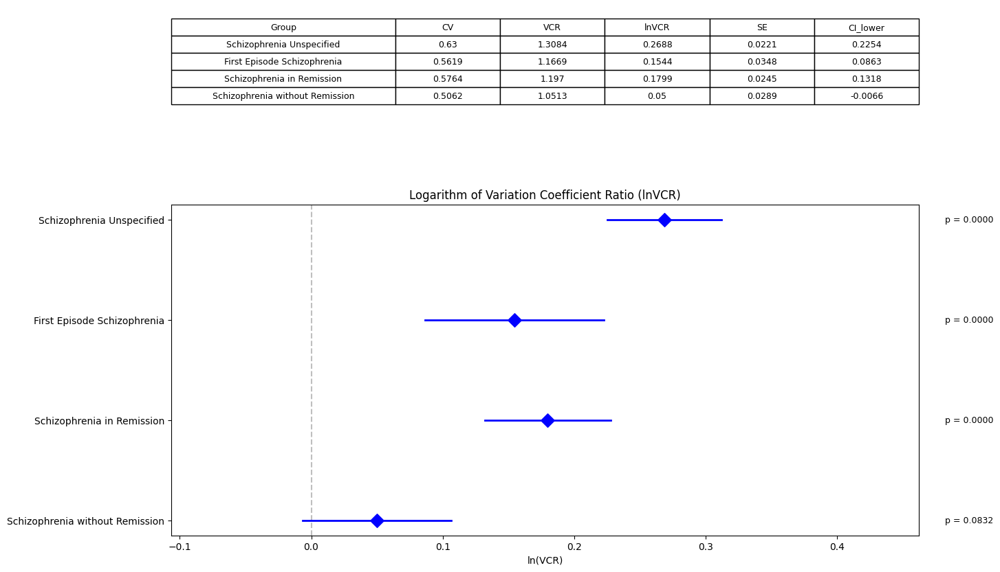

# Post-hoc Analysis of Variation in Neutrophil-to-Lymphocyte Ratio Across Schizophrenia Subtypes


This repository contains additional statistical analyses examining variability patterns in Neutrophil-to-Lymphocyte Ratio (NLR) across different schizophrenia subtypes, extending the findings from our original study [doi: 10.52567/2712-9179-2024-4-3-12-23].

## Project Overview
This post-hoc analysis investigates the heterogeneity in NLR measurements across schizophrenia subtypes using variation coefficient ratios and standardized mean differences. The analysis aims to provide deeper insights into the patterns of inflammatory marker variability in different manifestations of schizophrenia.

## Repository Structure
```python
repository/
└── posthoc_nlr.ipynb    # Jupyter notebook containing all analyses
```

## Data Structure
```python
# Input data format
groups = ['Schizophrenia Unspecified', 'First Episode Schizophrenia',
          'Schizophrenia in Remission', 'Schizophrenia without Remission']
means = [2.27, 1.94, 2.03, 2.43]
sds = [1.43, 1.09, 1.17, 1.23]
ns = [9148, 648, 3019, 1256]
control_mean = 1.62
control_sd = 0.78
control_n = 1150
```

## Methods
1. **Variation Coefficient Ratio (lnVCR) Analysis**
   - Calculation of coefficient variation ratios
   - Computation of confidence intervals
   - Forest plot visualization
   - AIC/BIC model comparison

2. **Mean Difference Analysis**
   - Standardized mean differences calculation
   - Confidence interval estimation
   - Statistical significance testing

3. **Sensitivity Analysis**
   - Leave-one-out approach
   - Impact assessment of individual groups
   - Robustness evaluation

## Requirements
```python
requirements = [
    'python>=3.8',
    'numpy',
    'pandas',
    'matplotlib',
    'scipy',
    'statsmodels'
]
```


# Analysis Results

## lnVCR Analysis
We performed a logarithm of Variation Coefficient Ratio (lnVCR) analysis across different schizophrenia subtypes:
- Schizophrenia Unspecified showed the highest variability (lnVCR = 0.2688, p < 0.001)
- First Episode Schizophrenia (lnVCR = 0.1544, p < 0.001)
- Schizophrenia in Remission (lnVCR = 0.1799, p < 0.001)
- Schizophrenia without Remission showed the lowest effect (lnVCR = 0.05, p = 0.0832)

## Model Comparison
The AIC/BIC analysis strongly favored the observed model over the null model:
- Observed model showed better fit (AIC = 42.64, BIC = 41.42)
- Null model performed worse (AIC = 226.86, BIC = 225.44)
- LogLik values further supported this conclusion
- Chi-square test confirmed significant difference (p < 0.001)

## Mean Differences Analysis
Forest plot analysis revealed significant mean differences from control:
- All groups showed positive mean differences
- Strongest effect in Schizophrenia Unspecified
- Significant effects across all subtypes except Schizophrenia without Remission
- 95% confidence intervals suggest reliable effects

## Sensitivity Analysis
Leave-one-out analysis revealed:
- Excluding Schizophrenia without Remission had the largest impact on lnVCR (+0.0377)
- Mean differences remained robust to group exclusion
- First Episode Schizophrenia showed consistent effects across analyses
- Results suggest stability of findings with minor variations based on group inclusion

These findings suggest heterogeneous variability patterns across schizophrenia subtypes, with particularly strong effects in unspecified cases and more stable patterns in first-episode cases.

## Key Findings
- Identified significant heterogeneity in NLR variability across subgroups
- Found distinct patterns of variation in different schizophrenia manifestations
- Confirmed robustness of results through sensitivity analyses
- Demonstrated utility of lnVCR for measuring biological variability

## Limitations
- Based on aggregated data
- Cannot account for individual variations
- Limited to available subgroup classifications

## Contact
For queries regarding this post-hoc analysis:
- Open an issue in this repository
- Email: fedor3016@gmail.com

## Author
Fedor Kostin


*"Understanding variability in biological markers is crucial for advancing personalized medicine approaches in psychiatry."*


```markdown
# Post-hoc Analysis of Variation in Neutrophil-to-Lymphocyte Ratio Across Schizophrenia Subtypes


This repository contains additional statistical analyses examining variability patterns in Neutrophil-to-Lymphocyte Ratio (NLR) across different schizophrenia subtypes, extending the findings from our original study [doi: 10.52567/2712-9179-2024-4-3-12-23].

## Project Overview
This post-hoc analysis investigates the heterogeneity in NLR measurements across schizophrenia subtypes using variation coefficient ratios and standardized mean differences. The analysis aims to provide deeper insights into the patterns of inflammatory marker variability in different manifestations of schizophrenia.

## Repository Structure
```python
repository/
└── posthoc_nlr.ipynb    # Jupyter notebook containing all analyses
```

## Data Structure
```python
# Input data format
groups = ['Schizophrenia Unspecified', 'First Episode Schizophrenia',
          'Schizophrenia in Remission', 'Schizophrenia without Remission']
means = [2.27, 1.94, 2.03, 2.43]
sds = [1.43, 1.09, 1.17, 1.23]
ns = [9148, 648, 3019, 1256]
control_mean = 1.62
control_sd = 0.78
control_n = 1150
```

## Methods
1. **Variation Coefficient Ratio (lnVCR) Analysis**
   - Calculation of coefficient variation ratios
   - Computation of confidence intervals
   - Forest plot visualization
   - AIC/BIC model comparison

2. **Mean Difference Analysis**
   - Standardized mean differences calculation
   - Confidence interval estimation
   - Statistical significance testing

3. **Sensitivity Analysis**
   - Leave-one-out approach
   - Impact assessment of individual groups
   - Robustness evaluation

## Requirements
```python
requirements = [
    'python>=3.8',
    'numpy',
    'pandas',
    'matplotlib',
    'scipy',
    'statsmodels'
]
```

## Analysis Results

### Visualizations

*Figure 1: Forest plot of lnVCR analysis with tabulated results*


*Figure 2: Forest plot of standardized mean differences*


*Figure 3: Effect size vs standard error plot with bubble sizes representing sample sizes*

 
*Figure 4: Effect size comparison across subgroups showing heterogeneity statistics (Q=36.92, p<0.0001, I²=91.9%)*


*Figure 5: Sensitivity analysis showing changes in lnVCR and mean differences when excluding each group*

### lnVCR Analysis
Coefficient of variation ratios show significant heterogeneity across groups:
- Schizophrenia Unspecified: CV=0.63, lnVCR=0.2688 (CI: 0.2254-0.3122)
- First Episode: CV=0.5619, lnVCR=0.1544 (CI: 0.0863-0.2225)
- In Remission: CV=0.5764, lnVCR=0.1799 (CI: 0.1318-0.2279)
- Without Remission: CV=0.5062, lnVCR=0.05 (CI: -0.0066-0.1066)

### Model Comparison
AIC/BIC analysis strongly favors observed over null model:
- Observed: AIC=98.86, BIC=97.63, LogLik=-47.43
- Null: AIC=1156.31, BIC=1155.70, LogLik=-577.16
- Model comparison p<0.0001

### Effect Size Analysis
Heterogeneity statistics:
- Q statistic: 36.92 (df=3)
- p-value: <0.0001 
- I² value: 91.9%

### Sensitivity Analysis
Leave-one-out results for lnVCR and mean differences:
- Excluding Schizophrenia Unspecified: lnVCR change=-0.0352, mean diff change=-0.0342
- Excluding First Episode: lnVCR change=0.0030, mean diff change=0.0758
- Excluding In Remission: lnVCR change=-0.0055, mean diff change=0.0458
- Excluding Without Remission: lnVCR change=0.0377, mean diff change=-0.0875

## Key Findings
- Significant heterogeneity across subgroups (I²=91.9%)
- Strongest variability in Unspecified group (lnVCR=0.2688)
- Most stable patterns in Without Remission group (lnVCR=0.05)
- Robust results confirmed through sensitivity analyses
- Model comparison strongly supports observed heterogeneity

## Limitations
- Based on aggregated data
- Cannot account for individual variations
- Limited to available subgroup classifications

## Author
Fedor Kostin

## Contact
For queries regarding this post-hoc analysis:
- Open an issue in this repository
- Email: fedor3016@gmail.com


*"Understanding variability in biological markers is crucial for advancing personalized medicine approaches in psychiatry."*
```

```
# Post-hoc Analysis of Variation in Neutrophil-to-Lymphocyte Ratio Across Schizophrenia Subtypes


This repository contains additional statistical analyses examining variability patterns in Neutrophil-to-Lymphocyte Ratio (NLR) across different schizophrenia subtypes, extending the findings from our original study [doi: 10.52567/2712-9179-2024-4-3-12-23].

## Project Overview
This post-hoc analysis investigates the heterogeneity in NLR measurements across schizophrenia subtypes using variation coefficient ratios and standardized mean differences. The analysis aims to provide deeper insights into the patterns of inflammatory marker variability in different manifestations of schizophrenia.

## Repository Structure
```python
repository/
└── posthoc_nlr.ipynb    # Jupyter notebook containing all analyses
```

## Data Structure
```python
# Input data format
groups = ['Schizophrenia Unspecified', 'First Episode Schizophrenia',
          'Schizophrenia in Remission', 'Schizophrenia without Remission']
means = [2.27, 1.94, 2.03, 2.43]
sds = [1.43, 1.09, 1.17, 1.23]
ns = [9148, 648, 3019, 1256]
control_mean = 1.62
control_sd = 0.78
control_n = 1150
```

## Methods
1. **Variation Coefficient Ratio (lnVCR) Analysis**
   - Calculation of coefficient variation ratios
   - Computation of confidence intervals
   - Forest plot visualization
   - AIC/BIC model comparison

2. **Mean Difference Analysis**
   - Standardized mean differences calculation
   - Confidence interval estimation
   - Statistical significance testing

3. **Sensitivity Analysis**
   - Leave-one-out approach
   - Impact assessment of individual groups
   - Robustness evaluation

## Requirements
```python
requirements = [
    'python>=3.8',
    'numpy',
    'pandas',
    'matplotlib',
    'scipy',
    'statsmodels'
]
```

## Analysis Results

### lnVCR Analysis Results

*Forest plot of lnVCR analysis with tabulated results*

Analysis of coefficient variation ratios showed:
- Unspecified: CV=0.63, lnVCR=0.2688 (CI: 0.2254-0.3122)
- First Episode: CV=0.5619, lnVCR=0.1544 (CI: 0.0863-0.2225)
- In Remission: CV=0.5764, lnVCR=0.1799 (CI: 0.1318-0.2279)
- Without Remission: CV=0.5062, lnVCR=0.05 (CI: -0.0066-0.1066)

All groups except "Without Remission" showed significantly higher variability compared to controls (p<0.001).

### Mean Differences Across Groups

*Forest plot of mean differences from control group*

Model comparison results:
- Observed model: AIC=98.86, BIC=97.63
- Null model: AIC=1156.31, BIC=1155.70
- Statistical significance: p<0.0001

### Heterogeneity Assessment

*Effect size vs standard error relationship with sample size representation*


*Effect size comparison showing heterogeneity between subgroups*

Heterogeneity statistics revealed substantial differences between subgroups:
- Q statistic: 36.92 (df=3)
- P-value: <0.0001
- I² value: 91.9%

### Sensitivity Analysis

*Impact of excluding individual groups on lnVCR and mean differences*

Leave-one-out analysis showed:
- Most influential group: Schizophrenia without Remission (lnVCR change: +0.0377)
- Most stable: First Episode Schizophrenia (lnVCR change: +0.0030)
- Mean difference changes ranged from -0.0875 to +0.0758

## Key Findings
- Significant heterogeneity across subgroups (I²=91.9%)
- Highest variability in Unspecified group
- Most homogeneous patterns in Without Remission group
- Results robust to group exclusion
- Strong evidence against homogeneity (Q=36.92, p<0.0001)

## Limitations
- Based on aggregated data
- Cannot account for individual variations
- Limited to available subgroup classifications

## Author
Fedor Kostin

## Contact
For queries regarding this post-hoc analysis:
- Open an issue in this repository
- Email: fedor3016@gmail.com


*"Understanding variability in biological markers is crucial for advancing personalized medicine approaches in psychiatry."*
```

How's this restructured version? The analysis sections now flow more logically with their corresponding visualizations.


